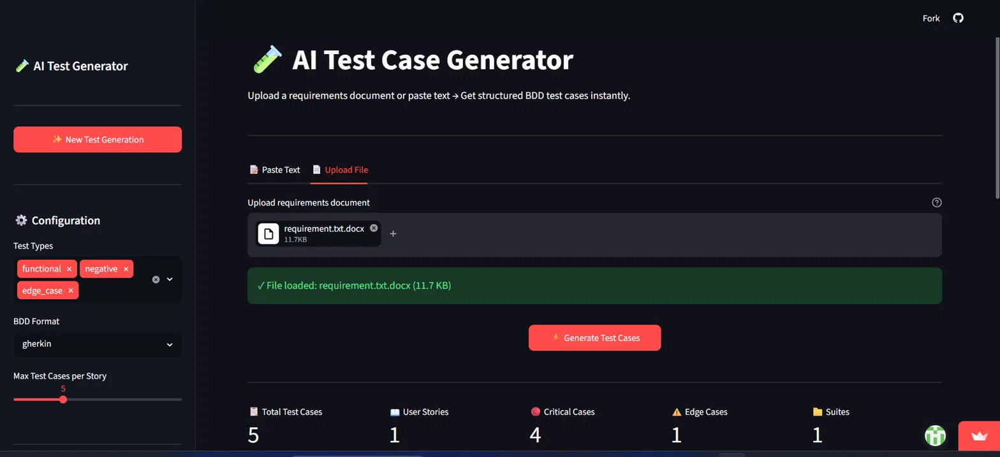
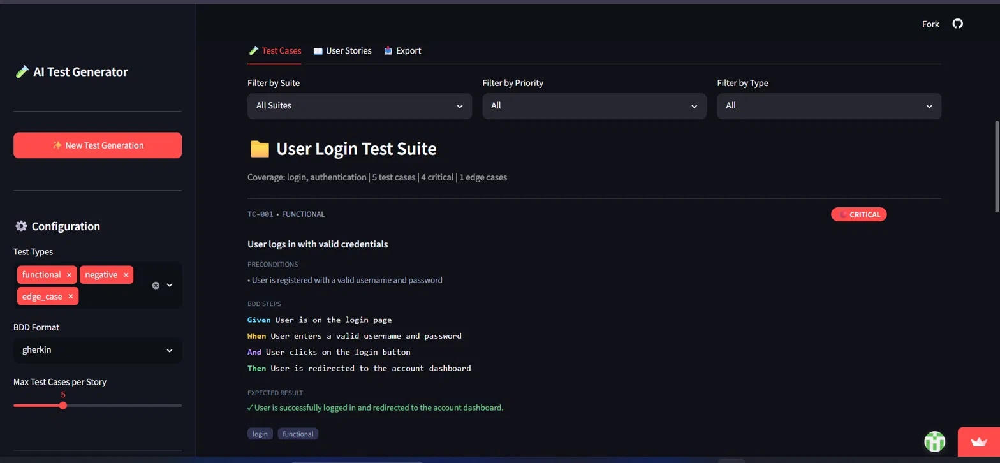
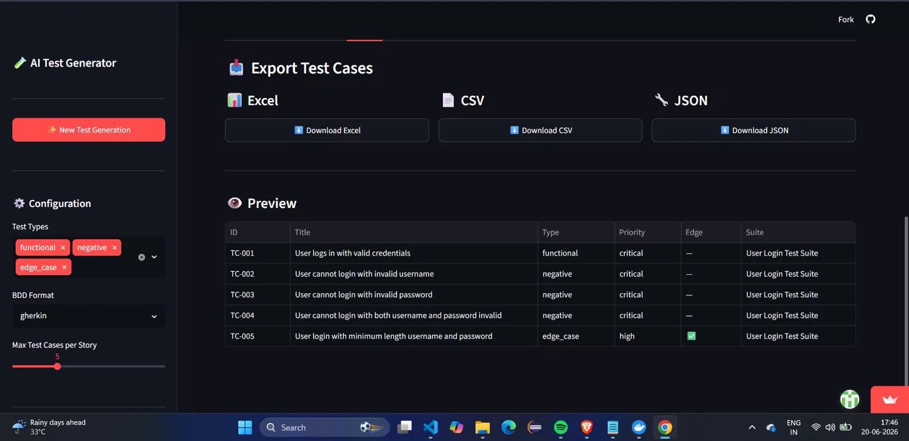
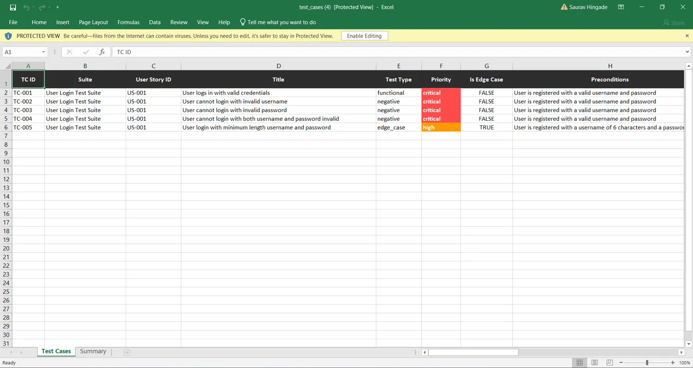
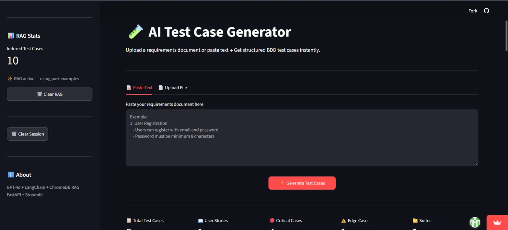

# 🧪 AI Test Case Generator

> Automatically generate structured BDD test cases from raw requirements documents using GPT-4o, LangChain, and a self-improving RAG pipeline.

[](https://ai-test-case-generator-api.streamlit.app/)
[](https://ai-test-case-generator-lbgi.onrender.com/docs)
[](https://python.org)

---

## 🎯 What It Does

Paste in a requirements document (or upload a PDF/DOCX) and the system:

1. **Extracts** structured user stories with acceptance criteria
2. **Generates** comprehensive BDD test cases (functional, negative, edge cases)
3. **Learns** from previously generated test cases using RAG — output gets better with use
4. **Exports** to Excel (color-coded), CSV, or JSON for your QA pipeline

Built to solve a real problem from my QA Automation background — manually writing test cases from PRDs is repetitive and inconsistent. This automates the first draft, so QA engineers can focus on judgment calls instead of boilerplate.

---

## 📸 Demo

### Generate test cases from a file upload


### Structured BDD test cases with filtering


### Export preview


### Color-coded Excel export


### Self-improving RAG — index grows with every generation


---

## 🏗️ Architecture

```
┌─────────────┐      ┌──────────────┐      ┌─────────────────┐
│  Streamlit   │ ───► │   FastAPI     │ ───► │   GPT-4o          │
│  Frontend    │      │   Backend     │      │   (LangChain LCEL) │
└─────────────┘      └──────┬───────┘      └─────────────────┘
                              │
                    ┌─────────┴──────────┐
                    │                       │
              ┌─────▼─────┐        ┌───────▼────────┐
              │  ChromaDB   │        │   Exporter      │
              │  (RAG)      │        │  JSON/CSV/Excel │
              └────────────┘        └────────────────┘
```

**Pipeline:**
```
Requirements Text/File
        ↓
Extractor Chain  →  Structured User Stories (Pydantic)
        ↓
RAG Retrieval    →  Similar past test cases (few-shot context)
        ↓
Generator Chain  →  Structured Test Suite (Pydantic, BDD format)
        ↓
Vector Index     →  Store for future RAG retrieval
        ↓
Export           →  Excel / CSV / JSON
```

---

## ✨ Key Features

- **Guaranteed structured output** — Pydantic schemas via `.with_structured_output()`, no brittle JSON parsing
- **Self-improving RAG** — every generated test case is indexed in ChromaDB and used as few-shot context for future requests
- **Multi-format input** — paste text, or upload PDF / DOCX / TXT
- **BDD-compliant output** — Given/When/Then steps, priority levels, edge-case flagging
- **Production export** — Excel sheets are color-coded by priority and auto-formatted
- **Full observability** — every chain call traced in LangSmith (tokens, latency, prompts)
- **Containerized** — Docker Compose for one-command local spin-up
- **Live deployed** — FastAPI on Render, Streamlit on Streamlit Cloud

---

## 🛠️ Tech Stack

| Layer | Technology |
|---|---|
| LLM | GPT-4o (OpenAI) |
| Orchestration | LangChain (LCEL) |
| Structured Output | Pydantic v2 |
| Vector Store / RAG | ChromaDB + OpenAI Embeddings |
| Backend API | FastAPI |
| Frontend | Streamlit |
| Observability | LangSmith |
| File Parsing | PyMuPDF, python-docx |
| Export | Pandas, OpenPyXL |
| Containerization | Docker, Docker Compose |
| Deployment | Render (API) + Streamlit Cloud (UI) |

---

## 🚀 Live Demo

| | Link |
|---|---|
| 🖥️ **App** | [ai-test-case-generator-api.streamlit.app](https://ai-test-case-generator-api.streamlit.app/) |
| ⚙️ **API Docs** | [Swagger UI](https://ai-test-case-generator-lbgi.onrender.com/docs) |
| ❤️ **Health Check** | [/health](https://ai-test-case-generator-lbgi.onrender.com/health) |

> ⚠️ Backend is hosted on Render's free tier — first request after inactivity may take ~30-50s to spin up.

---

## 💻 Run Locally

### Option 1 — Docker (recommended)

```bash
git clone https://github.com/sauravhingade/AI-Test-Case-Generator.git
cd AI-Test-Case-Generator

# Add your keys
cp .env.example .env

docker compose up --build
```

- Frontend → `http://localhost:8501`
- Backend → `http://localhost:8000/docs`

### Option 2 — Manual setup

```bash
git clone https://github.com/sauravhingade/AI-Test-Case-Generator.git
cd AI-Test-Case-Generator

python -m venv venv
venv\Scripts\activate          # Windows
# source venv/bin/activate     # macOS/Linux

pip install -r requirements.txt
cp .env.example .env           # add your OPENAI_API_KEY

# Terminal 1 — backend
uvicorn backend.main:app --reload --port 8000

# Terminal 2 — frontend
streamlit run frontend/app.py
```

### Environment Variables

```bash
OPENAI_API_KEY=sk-...
LANGCHAIN_TRACING_V2=true
LANGCHAIN_API_KEY=ls__...
LANGCHAIN_PROJECT=ai-test-generator
```

---

## 📁 Project Structure

```
ai_test_generator/
├── backend/
│   ├── main.py                  # FastAPI app & routes
│   ├── chains/
│   │   ├── extractor_chain.py   # Requirements → User Stories
│   │   ├── generator_chain.py   # User Story → Test Suite
│   │   └── rag_chain.py         # RAG retrieval logic
│   ├── schemas/
│   │   └── models.py            # Pydantic models
│   ├── rag/
│   │   └── vectorstore.py       # ChromaDB setup & indexing
│   └── utils/
│       └── exporter.py          # CSV / Excel / JSON export
├── frontend/
│   └── app.py                   # Streamlit UI
├── Dockerfile.backend
├── Dockerfile.frontend
├── docker-compose.yml
├── requirements.txt
└── README.md
```

---

## 🔌 API Reference

| Method | Endpoint | Description |
|---|---|---|
| `GET` | `/health` | Health check + RAG index count |
| `POST` | `/generate` | Generate test cases from raw text |
| `POST` | `/generate/file` | Generate test cases from PDF/DOCX/TXT |
| `GET` | `/export/{format}` | Export last result — `json`, `csv`, or `excel` |
| `GET` | `/rag/stats` | Indexed test case count |
| `DELETE` | `/rag/clear` | Clear RAG vector store |

Full interactive docs: [`/docs`](https://ai-test-case-generator-lbgi.onrender.com/docs)

---

## 🧠 Design Decisions

**Why structured output over raw LLM text?**
Free-text LLM responses are unreliable to parse downstream. Using `llm.with_structured_output(PydanticModel)` guarantees every test case has the exact fields a QA pipeline needs — no regex, no broken JSON.

**Why RAG instead of just prompting?**
A team's test case style (naming conventions, granularity, tagging) is hard to capture in a static prompt. Indexing generated test cases and retrieving similar ones as few-shot examples lets output quality compound over time without re-training anything.

**Why FastAPI + Streamlit instead of a single app?**
Mirrors real production architecture — a stateless API that any client (web, CLI, CI/CD pipeline) can call, decoupled from the demo UI.

---

## 🗺️ Roadmap

- [ ] Pinecone for persistent production-grade vector storage
- [ ] Jira/TestRail direct integration
- [ ] Multi-LLM support (Claude, Gemini fallback)
- [ ] Test case versioning & diffing

---

## 👤 Author

**Saurav Hingade**
AI/Agentic Engineer

[LinkedIn](https://www.linkedin.com/in/saurav-hingade-78b685313/) • [GitHub](https://github.com/sauravhingade)

---

## 📄 License

MIT
